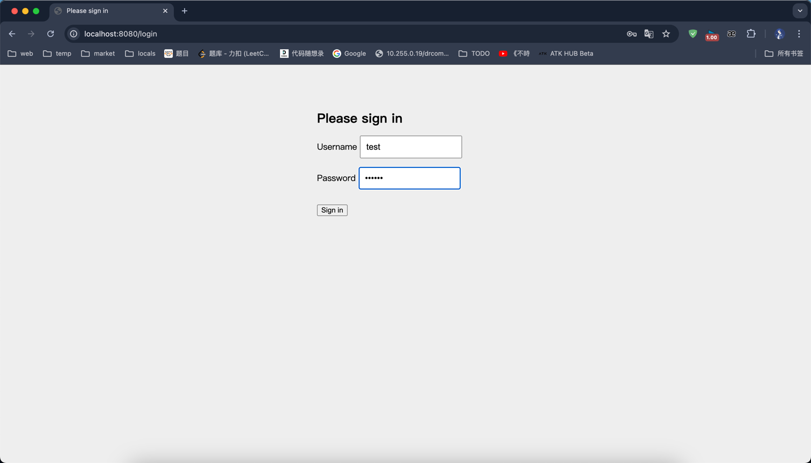
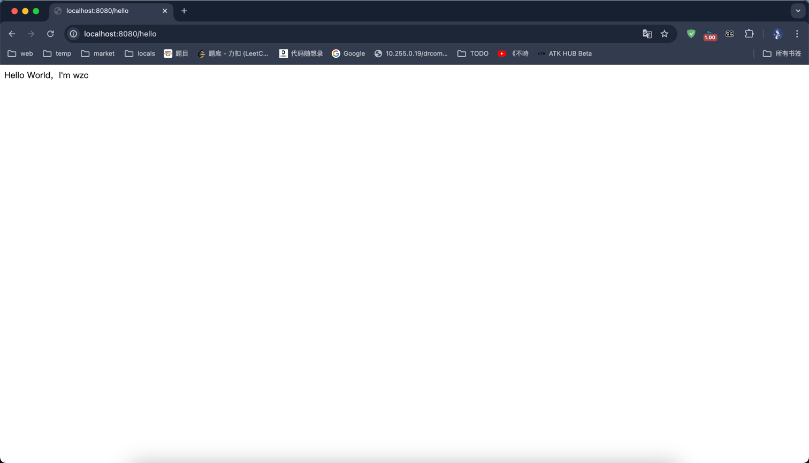

完成了后端的作业：通过 spring security 实现了登录认证。

## 使用方法

启动 application，浏览器访问地址：http://localhost:8080/hello 

由于未进行登录认证，所以会自动跳转到 http://localhost:8080/login 进行认证，输入默认的用户名和密码：
- username：test
- password：123456

即可看到结果：

